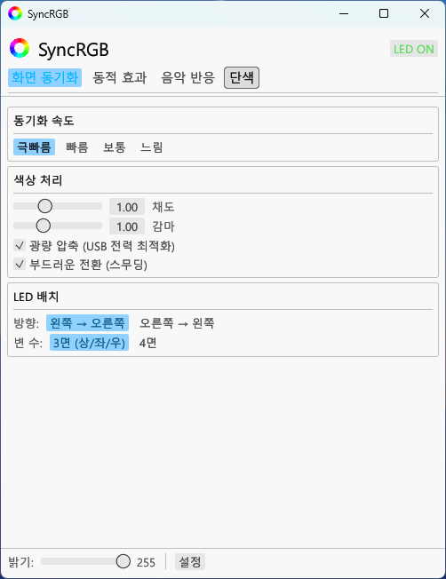
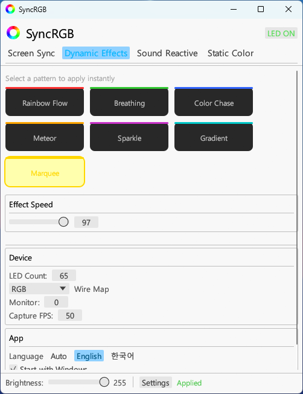
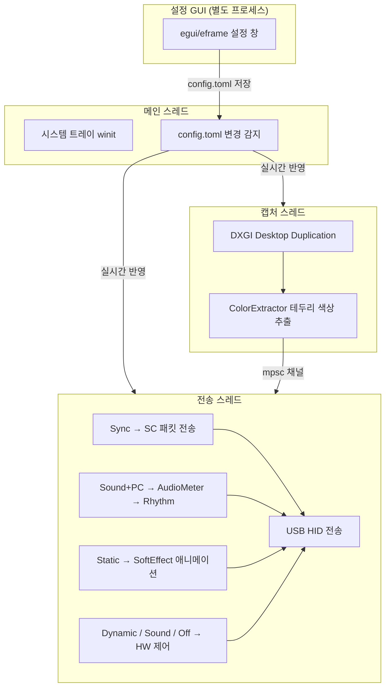

🌐 [English](README.md) | [한국어](README.ko.md)

# SyncRGB

Robobloq LED 스트립을 PC에서 제어하는 경량 네이티브 앱.
[SyncLight](https://www.robobloq.com/pages/synclight) (Electron 앱)의 핵심 기능을 Rust로 재작성.


---

## 주요 기능

| 모드 | 설명 |
|------|------|
| **화면 동기화** | 모니터 테두리 색상을 실시간으로 LED에 반영 (DXGI Desktop Duplication) |
| **동적 효과** | 하드웨어 내장 효과 12종 (무지개, 흐름, 호흡 등) + 속도 조절 |
| **음악 반응 (컨트롤러)** | 디바이스 내장 마이크로 음악 감지 → LED 반응 |
| **음악 반응 (컴퓨터)** | PC 시스템 오디오를 WASAPI로 캡처 → LED 실시간 반응 |
| **단색** | 원하는 색상으로 전체 LED 설정 |
| **단색 숨쉬기/회전** | 단색 + 숨쉬기/회전 애니메이션 (SyncRGB 전용) |
| **LED 끄기** | LED 전원 off |

---

## 스크린샷




---

## SyncLight 리버스 엔지니어링 분석

SyncRGB 개발 및 성능 비교를 위해 원본 SyncLight(Electron 앱)의 webpack 번들을 리버스 엔지니어링 분석했습니다.

### 분석 방법

1. SyncLight 설치 디렉토리에서 Electron asar 추출
2. `.webpack/main/index.js` (956KB, minified 단일 파일) 분석
3. 세미콜론 기준 줄 분리 후 키워드 검색으로 핵심 로직 역추적
4. `@warren-robobloq/quiklight` 네이티브 모듈 구조 확인

### 캡처 타이밍 설정값

번들 내 글로벌 설정 객체에서 다음 값을 확인:

```javascript
const g = {
  samplingRate: 20,     // 화면 캡처 간격 (ms) → 50fps
  audioInterval: 40,    // 오디오 리듬 전송 간격 (ms) → 25Hz
  // ...
};
```

### 캡처 루프 구조

```javascript
const Te = () => {
  const displays = T.getMonitors();
  const syncSpeed = store.get("syncSpeed") || 0;
  const samplingRate = g.samplingRate;  // 20ms 고정

  worker = new Worker(captureWorkerURL, {
    workerData: {
      displays,
      finalSyncSpeed: syncSpeed + 20,  // 전송 딜레이 = syncSpeed + 20ms
      samplingRate                      // 캡처 간격 = 20ms
    }
  });

  worker.on("message", (colors) => {
    setSyncScreen(devices, colors, displays, samplingRate);
  });
};
```

### 확인된 타이밍 사양

| 항목 | 값 | 비고 |
|------|:--:|------|
| **화면 캡처 간격** | 20ms | **50fps** (Worker 스레드) |
| **전송 딜레이** | syncSpeed + 20ms | syncSpeed 기본값 0 → 20ms |
| **오디오 리듬 간격** | 40ms | 25Hz, `setComputerRhythm` |
| **캡처 방식** | Electron Worker 스레드 | `desktopCapturer` API 기반 |

> 이 분석 결과에 따라, 성능 비교 시 SyncRGB의 캡처 FPS를 SyncLight와 동일한 **50fps**로 설정하여 동일 조건에서 측정.

---

## 성능 비교

양쪽 모두 **50fps (20ms 캡처 간격)** 으로 맞추고, 동일 조건에서 측정.
- 화면 동기화 모드, 같은 YouTube 및 넷플릭스 영상, 동일 구간 반복 재생
- 20초간 1초 간격 샘플링, 12회 측정 평균

| 항목 | SyncRGB (Rust) | SyncLight (Electron) | 절감 |
|------|:-:|:-:|:-:|
| **CPU 평균** | 2.92% | 17.13% | **5.9배** |
| **CPU 최대** | 3.85% | 20.29% | 5.3배 |
| **RAM 평균** | 58.5 MB | 432.6 MB | **7.4배** |
| **RAM 최대** | 71.2 MB | 444.9 MB | 6.2배 |
| 프로세스 수 | 1 | 5 | - |
| 스레드 수 | 22 | 126 | 5.7배 |
| 핸들 수 | 387 | 2,499 | 6.5배 |

> 측정 환경: Windows 11, 12코어 CPU, 65개 LED, **50fps 캡처**, 12회 평균

---

## 지원 디바이스

- **Robobloq LED 스트립** (https://ko.aliexpress.com/item/1005009023785106.html)
- USB HID 연결 (VID: `0x1A86`, PID: `0xFE07`)
- 플러그 앤 플레이 — 드라이버 설치 불필요

---

## 설치 및 실행

### 다운로드 (빌드 없이 바로 사용)

[GitHub Releases](https://github.com/Tonic-Jin/SyncRGB/releases)에서 최신 `SyncRGB.exe`를 다운로드하여 원하는 폴더에 넣고 실행하면 됩니다.

### 직접 빌드

**사전 요구사항:**
- Windows 10/11 (64-bit)
- [Rust 툴체인](https://rustup.rs/) (stable, MSVC)
- Visual Studio Build Tools (C++ 빌드 도구)

```bash
git clone https://github.com/Tonic-Jin/SyncRGB.git
cd SyncRGB
cargo build --release
```

빌드 결과: `target/release/SyncRGB.exe`

### 실행

1. `SyncRGB.exe` 실행 → 시스템 트레이에 RGB 링 아이콘 표시
2. Robobloq LED 스트립을 USB로 연결 (자동 인식, 드라이버 불필요)
3. 트레이 아이콘 우클릭 → **일시정지 / 설정 / 종료**

### 설정 GUI

트레이 메뉴에서 **설정**을 클릭하면 별도 창이 열립니다.
모드 전환, 밝기, 색상, 효과 속도 등 모든 설정을 GUI에서 변경할 수 있으며, 변경 즉시 반영됩니다.

설정은 실행 파일과 같은 폴더의 `config.toml`에 저장되며, 직접 편집해도 실시간 반영됩니다.

### 옵션
| 플래그 | 설명 |
|--------|------|
| `--settings` | 설정 GUI만 단독 실행 |
| `--console` | 릴리즈 빌드에서도 콘솔 로그 표시 |

---

## 설정

실행 파일과 같은 디렉토리의 `config.toml`로 설정.
GUI 설정 창에서 변경하거나 직접 편집 가능 — **실시간 반영** (파일 변경 감지).

```toml
[device]
com_port = "auto"          # 미사용 (USB HID 자동 탐색)
wire_map = "RGB"           # LED 색상 채널 순서 (RGB/RBG/GRB/GBR/BRG/BGR)
display_size = 27          # 모니터 크기 (인치)
lamps_amount = 65          # LED 개수

[capture]
fps = 30                   # 캡처 프레임레이트
monitor = 0                # 모니터 인덱스 (0 = 기본)
sample_width = 50          # 테두리 샘플링 폭 (px)

[sync]
speed = 0                  # 전송 속도 (0=극빠름 20ms ~ 100=느림 120ms)
brightness = 255           # 밝기 (0~255)
gamma = 1.0                # 감마 보정
saturation = 1.0           # 채도 부스트 (0.0=끔, 1.0=3x HSL 부스트)
light_compression = true   # 광량 압축 (R+G+B > 255 시 정규화)
smoothing = true           # 시간축 스무딩
reverse = false            # LED 방향 반전
edge_number = 3            # 변 수 (3=상좌우, 4=전체)

[effect]
mode = "sync"              # 모드: sync / dynamic / sound / static / off
dynamic_index = 0          # 동적 효과 번호 (0~11)
sound_index = 0            # 음악 효과 번호 (0~8)
effect_speed = 50          # 효과 속도 (1~100)
color_r = 255              # 단색 R
color_g = 0                # 단색 G
color_b = 0                # 단색 B
rhythm_source = "controller"  # 음악 소스: controller (디바이스 마이크) / computer (PC 오디오)
soft_effect = "none"       # 소프트웨어 효과: none / breathe / rotate

[app]
autostart = false          # Windows 시작 시 자동 실행
show_console = false       # 콘솔 창 표시
language = "auto"          # UI 언어: auto / en / ko
```

---

## 아키텍처



### 스레드 구성
| 스레드 | 역할 |
|--------|------|
| **main** | 시스템 트레이 UI, 메뉴 이벤트, config.toml 변경 감지 |
| **capture** | DXGI Desktop Duplication으로 화면 캡처 → 색상 추출 → 채널 전송 |
| **sender** | 채널에서 색상 수신 → 프로토콜 인코딩 → USB HID 전송 |

### 설정 GUI
`--settings` 플래그 또는 트레이 메뉴 "설정"으로 별도 프로세스로 실행.
egui/eframe 네이티브 윈도우에서 모든 설정 변경 가능 → config.toml 저장 → 메인 프로세스가 자동 감지.

---

## 프로젝트 구조

```
SyncRGB/
├── Cargo.toml                    # 의존성 및 빌드 설정
├── config.toml                   # 사용자 설정 파일
├── src/
│   ├── main.rs                   # 진입점, 스레드 관리, 트레이, 색상 후처리
│   ├── audio.rs                  # WASAPI 오디오 피크 미터 (컴퓨터 리듬)
│   ├── config.rs                 # 설정 구조체, TOML 직렬화, 자동시작 레지스트리
│   ├── gui.rs                    # egui 설정 GUI
│   ├── capture/
│   │   ├── mod.rs
│   │   └── dxgi.rs               # DXGI Desktop Duplication 화면 캡처
│   ├── color/
│   │   ├── mod.rs
│   │   └── extractor.rs          # 테두리 색상 추출, LED 매핑, 스무딩
│   ├── device/
│   │   ├── mod.rs
│   │   ├── protocol.rs           # RB/SC 프로토콜 패킷 빌더
│   │   └── serial.rs             # USB HID 연결, 읽기/쓰기
│   └── bin/
│       └── hid_probe.rs          # HID 디바이스 디버깅 도구
```

---

## 프로토콜

Robobloq LED 스트립은 USB HID를 통해 두 가지 프로토콜로 통신합니다.

### SC 프로토콜 (화면 동기화 전용)
```
Byte:  [0][1] [2][3]     [4]  [5]    [6...]          [끝]
       "S""C"  길이(BE)   SID  0x80   색상데이터       체크섬
```
- 색상 데이터: `[LED인덱스, R, G, B, LED인덱스]` × LED 수 (5바이트 그룹)
- 길이: 2바이트 Big-Endian

### RB 프로토콜 (제어 명령)
```
Byte:  [0][1] [2]   [3]  [4]    [5...]     [끝]
       "R""B"  길이   SID  액션   페이로드    체크섬
```

### 액션 코드

| 코드 | 이름 | 페이로드 | 응답대기 |
|:----:|------|----------|:--------:|
| `0x80` | setSyncScreen | 색상 데이터 (SC 프로토콜) | X |
| `0x82` | readDeviceInfo | - | O |
| `0x85` | setLedEffect | effectType, effectIndex | O |
| `0x86` | setSectionLED | 색상+LED범위 | X |
| `0x87` | setBrightness | value (0~255) | O |
| `0x8A` | setDynamicSpeed | speed (5~100) | O |
| `0x97` | turnOffLight | - | O |
| `0x98` | setComputerRhythm | effectIndex, volume (0~100) | X |

### HID 전송 규칙
- Report ID `0x00`을 데이터 앞에 붙여 전송
- 64바이트 단위 청킹
- `interface_number() == 0`으로 연결

---

## 색상 처리 파이프라인

화면 동기화 모드에서 프레임당 처리 흐름:

```
DXGI 캡처 (BGRA 프레임)
    ↓
ColorExtractor: 모니터 테두리 영역 샘플링
    ↓
LED별 RGB 추출 + 시간축 스무딩 (최근 10프레임 평균)
    ↓
Wire Map: 디바이스 색상 채널 순서 변환 (RGB → GRB 등)
    ↓
Convert to Black: 약한 색 제거 (threshold=20), 지배적 채널 강조
    ↓
5바이트 그룹 인코딩: [idx, R, G, B, idx]
    ↓
Low Light 보정:
  ├── 채도 부스트 (HSL, factor 3x)
  └── 광량 압축 (R+G+B > 255 → 정규화)
    ↓
SC 프로토콜 패킷 → USB HID 전송
```

---

## 컴퓨터 리듬 (PC 오디오 → LED)

원본 SyncLight와 동일한 동작을 구현:

1. **Windows WASAPI** `IAudioMeterInformation::GetPeakValue()`로 시스템 오디오 피크 레벨 취득
2. **노이즈 게이트**: `≤ 0.01 → 0` (무음 시 LED 반응 억제)
3. **스무딩 없음**: 원시 피크값을 그대로 사용 (원본 SyncLight 동일)
4. **40ms 간격**으로 `setComputerRhythm(effectIndex, volume)` 전송
5. `writeWithoutResponse`로 딜레이 없이 전송

---

## 코딩 방식

### 설계 원칙
- **최소 의존성**: Electron/Node.js 제거, Rust 네이티브만 사용
- **단일 프로세스**: 캡처/전송/UI를 스레드로 분리 (프로세스 오버헤드 제거)
- **제로 카피 프로토콜**: SyncLight의 JS 객체 변환 없이 바이트 배열 직접 구성
- **실시간 설정 반영**: AtomicU32 버전 카운터 + 파일 mtime 비교로 폴링

### 사용 기술
| 영역 | 기술 |
|------|------|
| 화면 캡처 | DXGI Desktop Duplication (Direct3D 11) |
| USB 통신 | hidapi (cross-platform HID) |
| 오디오 피크 미터 | Windows WASAPI (`IAudioMeterInformation`) |
| GUI | egui + eframe (즉시 모드 UI) |
| 시스템 트레이 | tray-icon + winit |
| 설정 | serde + toml |
| 자동 시작 | winreg (Windows Registry) |

### 원본 SyncLight 리버스 엔지니어링
- Electron asar 추출 → webpack 번들 분석
- 모듈 의존성 추적: 디바이스 팩토리 → HID 클래스 → 프로토콜
- 프로토콜 바이트 구조, 모드 전환 흐름, 오디오 워커 동작 리버스 엔지니어링
- 원본의 텔레메트리/머신 ID 수집 등 불필요한 동작은 제거

---

## 의존성

| 크레이트 | 용도 |
|----------|------|
| `windows` | DXGI, Direct3D 11, WASAPI, COM, 콘솔 API |
| `hidapi` | USB HID 통신 |
| `tray-icon` | 시스템 트레이 아이콘 |
| `winit` | 이벤트 루프 |
| `egui` + `eframe` | 설정 GUI |
| `serde` + `toml` | 설정 직렬화/역직렬화 |
| `winreg` | Windows 레지스트리 (자동 시작) |
| `log` + `env_logger` | 로깅 |

---

## 기여

[Claude](https://claude.ai/)의 도움을 받아 개발했습니다. 버그 제보, 아이디어, PR 모두 환영합니다 — [Issues](https://github.com/Tonic-Jin/SyncRGB/issues)

---

## 라이선스

MIT License
