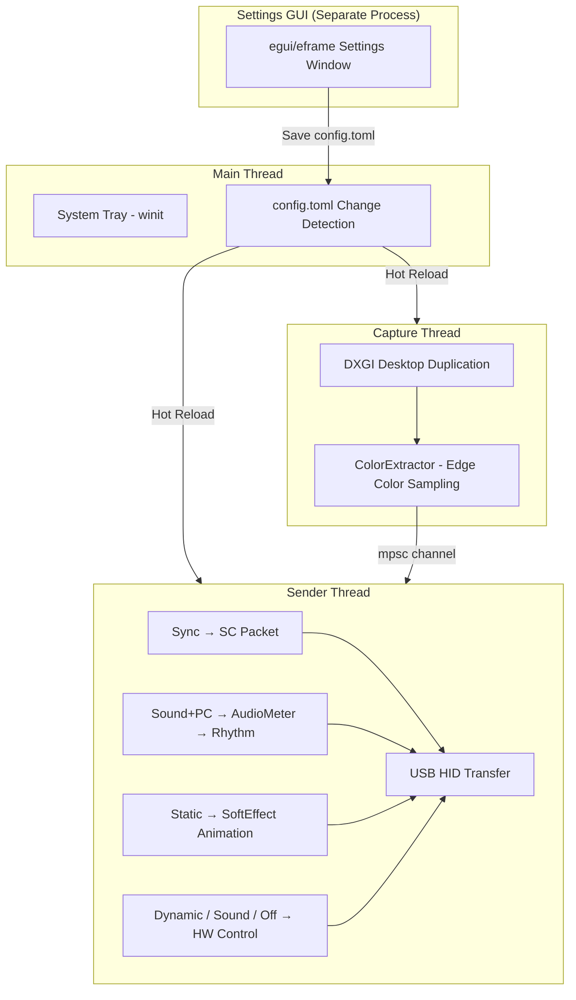

🌐 [English](README.md) | [한국어](README.ko.md)

# SyncRGB

A lightweight native app to control Robobloq LED strips from your PC.
Core features of [SyncLight](https://www.robobloq.com/pages/synclight) (Electron app) rewritten in Rust.


---

## Features

| Mode | Description |
|------|-------------|
| **Screen Sync** | Real-time LED sync with monitor edge colors (DXGI Desktop Duplication) |
| **Dynamic Effects** | 12 built-in hardware effects (rainbow, flow, breathing, etc.) + speed control |
| **Sound Reactive (Controller)** | Device built-in mic detects music → LED reacts |
| **Sound Reactive (Computer)** | Captures PC system audio via WASAPI → real-time LED reaction |
| **Static Color** | Set all LEDs to a single color |
| **Static Breathe/Rotate** | Static color + breathing/rotation animation (SyncRGB exclusive) |
| **LED Off** | Turn off LEDs |

---

## Screenshots


---

## SyncLight Reverse Engineering Analysis

Reverse engineered the original SyncLight (Electron app) webpack bundle for development and performance comparison.

### Methodology

1. Extracted Electron asar from SyncLight installation directory
2. Analyzed `.webpack/main/index.js` (956KB, single minified file)
3. Split by semicolons, keyword search to trace core logic
4. Examined `@warren-robobloq/quiklight` native module structure

### Capture Timing Configuration

Found in the global config object within the bundle:

```javascript
const g = {
  samplingRate: 20,     // Screen capture interval (ms) → 50fps
  audioInterval: 40,    // Audio rhythm interval (ms) → 25Hz
  // ...
};
```

### Capture Loop Structure

```javascript
const Te = () => {
  const displays = T.getMonitors();
  const syncSpeed = store.get("syncSpeed") || 0;
  const samplingRate = g.samplingRate;  // Fixed 20ms

  worker = new Worker(captureWorkerURL, {
    workerData: {
      displays,
      finalSyncSpeed: syncSpeed + 20,  // Send delay = syncSpeed + 20ms
      samplingRate                      // Capture interval = 20ms
    }
  });

  worker.on("message", (colors) => {
    setSyncScreen(devices, colors, displays, samplingRate);
  });
};
```

### Confirmed Timing Specs

| Item | Value | Note |
|------|:-----:|------|
| **Screen Capture Interval** | 20ms | **50fps** (Worker thread) |
| **Send Delay** | syncSpeed + 20ms | syncSpeed default 0 → 20ms |
| **Audio Rhythm Interval** | 40ms | 25Hz, `setComputerRhythm` |
| **Capture Method** | Electron Worker thread | `desktopCapturer` API based |

> Based on this analysis, SyncRGB's capture FPS was set to **50fps** (matching SyncLight) for fair benchmarking.

---

## Performance Comparison

Both set to **50fps (20ms capture interval)**, measured under identical conditions.
- Screen sync mode, same YouTube and Netflix videos, same segments on loop
- 1-second sampling over 20 seconds, averaged over 12 runs

| Metric | SyncRGB (Rust) | SyncLight (Electron) | Reduction |
|--------|:-:|:-:|:-:|
| **CPU Avg** | 2.92% | 17.13% | **5.9x** |
| **CPU Max** | 3.85% | 20.29% | 5.3x |
| **RAM Avg** | 58.5 MB | 432.6 MB | **7.4x** |
| **RAM Max** | 71.2 MB | 444.9 MB | 6.2x |
| Processes | 1 | 5 | - |
| Threads | 22 | 126 | 5.7x |
| Handles | 387 | 2,499 | 6.5x |

> Test environment: Windows 11, 12-core CPU, 65 LEDs, **50fps capture**, 12-run average

---

## Supported Devices

- **Robobloq LED Strip** (https://ko.aliexpress.com/item/1005009023785106.html)
- USB HID connection (VID: `0x1A86`, PID: `0xFE07`)
- Plug and play — no driver installation required

---

## Installation & Usage

### Download (no build required)

Download the latest `SyncRGB.exe` from [GitHub Releases](https://github.com/Tonic-Jin/SyncRGB/releases), place it in any folder, and run.

### Build from Source

**Prerequisites:**
- Windows 10/11 (64-bit)
- [Rust toolchain](https://rustup.rs/) (stable, MSVC)
- Visual Studio Build Tools (C++ build tools)

```bash
git clone https://github.com/Tonic-Jin/SyncRGB.git
cd SyncRGB
cargo build --release
```

Output: `target/release/SyncRGB.exe`

### Running

1. Run `SyncRGB.exe` → RGB ring icon appears in system tray
2. Connect Robobloq LED strip via USB (auto-detected, no driver needed)
3. Right-click tray icon → **Pause / Settings / Quit**

### Settings GUI

Click **Settings** from the tray menu to open a separate settings window.
Change modes, brightness, colors, effect speed — all changes apply instantly.

Settings are saved to `config.toml` in the same folder as the executable. Direct edits are also detected and applied in real-time.

### CLI Options
| Flag | Description |
|------|-------------|
| `--settings` | Launch settings GUI only |
| `--console` | Show console logs in release build |

---

## Configuration

Configure via `config.toml` in the same directory as the executable.
Edit through the GUI or manually — **real-time hot-reload** (file change detection).

```toml
[device]
com_port = "auto"          # Unused (USB HID auto-detection)
wire_map = "RGB"           # LED color channel order (RGB/RBG/GRB/GBR/BRG/BGR)
display_size = 27          # Monitor size (inches)
lamps_amount = 65          # Number of LEDs

[capture]
fps = 30                   # Capture framerate
monitor = 0                # Monitor index (0 = primary)
sample_width = 50          # Edge sampling width (px)

[sync]
speed = 0                  # Send speed (0=fastest 20ms ~ 100=slow 120ms)
brightness = 255           # Brightness (0~255)
gamma = 1.0                # Gamma correction
saturation = 1.0           # Saturation boost (0.0=off, 1.0=3x HSL boost)
light_compression = true   # Light compression (normalize when R+G+B > 255)
smoothing = true           # Temporal smoothing
reverse = false            # Reverse LED direction
edge_number = 3            # Edge count (3=top/left/right, 4=all sides)

[effect]
mode = "sync"              # Mode: sync / dynamic / sound / static / off
dynamic_index = 0          # Dynamic effect index (0~11)
sound_index = 0            # Sound effect index (0~8)
effect_speed = 50          # Effect speed (1~100)
color_r = 255              # Static color R
color_g = 0                # Static color G
color_b = 0                # Static color B
rhythm_source = "controller"  # Sound source: controller (device mic) / computer (PC audio)
soft_effect = "none"       # Software effect: none / breathe / rotate

[app]
autostart = false          # Auto-start with Windows
show_console = false       # Show console window
language = "auto"          # UI language: auto / en / ko
```

---

## Architecture



### Thread Architecture
| Thread | Role |
|--------|------|
| **main** | System tray UI, menu events, config.toml change detection |
| **capture** | DXGI Desktop Duplication screen capture → color extraction → channel send |
| **sender** | Receive colors from channel → protocol encoding → USB HID transfer |

### Settings GUI
Launched as a separate process via `--settings` flag or tray menu "Settings".
egui/eframe native window for all settings → saves config.toml → main process auto-detects changes.

---

## Project Structure

```
SyncRGB/
├── Cargo.toml                    # Dependencies and build config
├── config.toml                   # User settings
├── src/
│   ├── main.rs                   # Entry point, thread management, tray, color post-processing
│   ├── audio.rs                  # WASAPI audio peak meter (computer rhythm)
│   ├── config.rs                 # Config structs, TOML serialization, autostart registry
│   ├── gui.rs                    # egui settings GUI
│   ├── capture/
│   │   ├── mod.rs
│   │   └── dxgi.rs               # DXGI Desktop Duplication screen capture
│   ├── color/
│   │   ├── mod.rs
│   │   └── extractor.rs          # Edge color extraction, LED mapping, smoothing
│   ├── device/
│   │   ├── mod.rs
│   │   ├── protocol.rs           # RB/SC protocol packet builder
│   │   └── serial.rs             # USB HID connection, read/write
│   └── bin/
│       └── hid_probe.rs          # HID device debugging tool
```

---

## Protocol

The Robobloq LED strip communicates via USB HID using two protocols.

### SC Protocol (Screen Sync Only)
```
Byte:  [0][1] [2][3]       [4]  [5]    [6...]          [end]
       "S""C"  length(BE)   SID  0x80   color data       checksum
```
- Color data: `[LED index, R, G, B, LED index]` × LED count (5-byte groups)
- Length: 2-byte Big-Endian

### RB Protocol (Control Commands)
```
Byte:  [0][1] [2]     [3]  [4]      [5...]      [end]
       "R""B"  length   SID  action   payload      checksum
```

### Action Codes

| Code | Name | Payload | Wait Response |
|:----:|------|---------|:------------:|
| `0x80` | setSyncScreen | Color data (SC protocol) | No |
| `0x82` | readDeviceInfo | - | Yes |
| `0x85` | setLedEffect | effectType, effectIndex | Yes |
| `0x86` | setSectionLED | Color+LED range | No |
| `0x87` | setBrightness | value (0~255) | Yes |
| `0x8A` | setDynamicSpeed | speed (5~100) | Yes |
| `0x97` | turnOffLight | - | Yes |
| `0x98` | setComputerRhythm | effectIndex, volume (0~100) | No |

### HID Transfer Rules
- Prepend Report ID `0x00` before data
- 64-byte chunking
- Connect via `interface_number() == 0`

---

## Color Processing Pipeline

Per-frame processing flow in screen sync mode:

```
DXGI Capture (BGRA frame)
    ↓
ColorExtractor: Monitor edge region sampling
    ↓
Per-LED RGB extraction + temporal smoothing (10-frame moving average)
    ↓
Wire Map: Device color channel reordering (RGB → GRB, etc.)
    ↓
Convert to Black: Weak color removal (threshold=20), dominant channel boost
    ↓
5-byte group encoding: [idx, R, G, B, idx]
    ↓
Low Light Correction:
  ├── Saturation boost (HSL, 3x factor)
  └── Light compression (normalize when R+G+B > 255)
    ↓
SC Protocol Packet → USB HID Transfer
```

---

## Computer Rhythm (PC Audio → LED)

Identical behavior to original SyncLight:

1. **Windows WASAPI** `IAudioMeterInformation::GetPeakValue()` reads system audio peak level
2. **Noise gate**: `≤ 0.01 → 0` (suppress LED reaction during silence)
3. **No smoothing**: Raw peak value used directly (same as original SyncLight)
4. **40ms interval** sends `setComputerRhythm(effectIndex, volume)`
5. `writeWithoutResponse` for zero-delay transmission

---

## Design

### Principles
- **Minimal dependencies**: No Electron/Node.js, pure Rust native
- **Single process**: Capture/send/UI separated as threads (no process overhead)
- **Zero-copy protocol**: Direct byte array construction, no JS object conversion
- **Real-time config reload**: AtomicU32 version counter + file mtime polling

### Technologies
| Area | Technology |
|------|-----------|
| Screen Capture | DXGI Desktop Duplication (Direct3D 11) |
| USB Communication | hidapi (cross-platform HID) |
| Audio Peak Meter | Windows WASAPI (`IAudioMeterInformation`) |
| GUI | egui + eframe (immediate mode UI) |
| System Tray | tray-icon + winit |
| Configuration | serde + toml |
| Auto-start | winreg (Windows Registry) |

### SyncLight Reverse Engineering
- Electron asar extraction → webpack bundle analysis
- Module dependency tracing: device factory → HID class → protocol
- Protocol byte structures, mode switching flow, audio worker reverse engineering
- Removed unnecessary telemetry/machine ID collection from original

---

## Dependencies

| Crate | Purpose |
|-------|---------|
| `windows` | DXGI, Direct3D 11, WASAPI, COM, Console API |
| `hidapi` | USB HID communication |
| `tray-icon` | System tray icon |
| `winit` | Event loop |
| `egui` + `eframe` | Settings GUI |
| `serde` + `toml` | Config serialization/deserialization |
| `winreg` | Windows Registry (auto-start) |
| `log` + `env_logger` | Logging |

---

## Contributing

Built with help from [Claude](https://claude.ai/). Bugs, ideas, PRs — all welcome at [Issues](https://github.com/Tonic-Jin/SyncRGB/issues).

---

## License

MIT License
